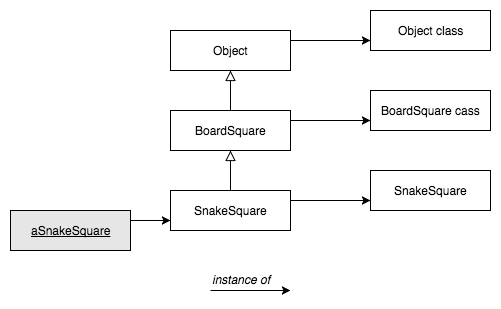
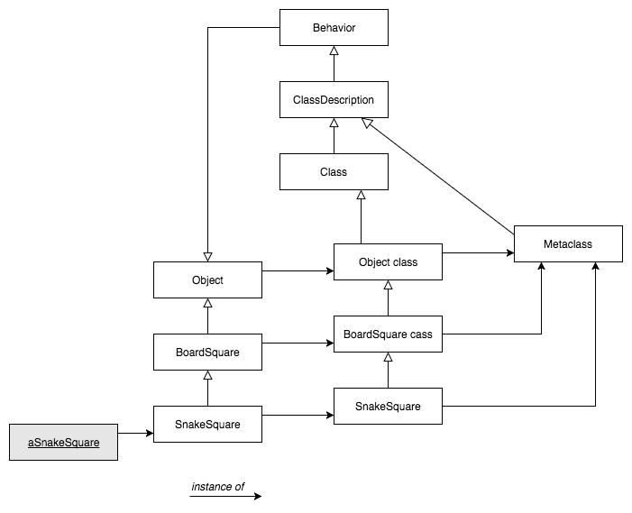

# Reflexió en Smalltalk

- [Pròleg](https://github.com/felixarpa/CAP-Reflexio/tree/master/reflexio/reflexio-en-smalltalk.md#pròleg)
	- [Les Mestaclasses en 7 parts](https://github.com/felixarpa/CAP-Reflexio/tree/master/reflexio/reflexio-en-smalltalk.md#les-metaclasses-en-7-parts)
	- [Classes Indexades i Variables d’Instància](https://github.com/felixarpa/CAP-Reflexio/tree/master/reflexio/reflexio-en-smalltalk.md#classes-indexades-i-variables-dinstància)
	- [Variables de class-instància](https://github.com/felixarpa/CAP-Reflexio/tree/master/reflexio/reflexio-en-smalltalk.md#variables-de-classe-instància)
	- [Variables de class](https://github.com/felixarpa/CAP-Reflexio/tree/master/reflexio/reflexio-en-smalltalk.md#variables-de-classe)
- [Reflexió](https://github.com/felixarpa/CAP-Reflexio/tree/master/reflexio/reflexio-en-smalltalk.md#reflexió)
	- [Introspecció](https://github.com/felixarpa/CAP-Reflexio/tree/master/reflexio/reflexio-en-smalltalk.md#introspecció)
	- [Intercessió](https://github.com/felixarpa/CAP-Reflexio/tree/master/reflexio/reflexio-en-smalltalk.md#intercessió)

## Pròleg

### Les *Metaclasses* en 7 parts

#### 1. Tot objecte és instància d’una classe

#### 2. Tota classe hereta eventualment d’Object

Tot és un objecte. La classe de cada objecte hereta d'*Object*

Quan un objecte rep un missatge, el mètode es busca
al diccionari de mètodes de la seva classe, i, si cal, a
les seves superclasses, fins arribar a *Object*.

*Object* representa el comportament comú a tots els objectes (com la gestió d'errors, per exemple). Totes les classes haurien d'heretar d'*Object*.

#### 3. Tota classe és instància d’una metaclasse

Com a Smalltalk tot és un objecte, les **classes també son objectes**. Cada classe *X* és l'única instància de la seva *metaclasse* anomenada *X class*.

Les *metaclasses* es crean quan es crea un classes de forma implícita. Les *metaclasses* no es comparteixen, cada classe és **instància única** de la seva *metaclasse*.



Per accedir a la *metaclasse* d'una classe s'ha d'activar el *class side* al Pharo.

#### 4. La jerarquia de metaclasses és equivalent a la jerarquia de classes


#### 5. Tota metaclasse hereta de Class i Behavior


##### Behavior

És el mínim estat necessari pels objectes que tenen instancies. Té l'interfície bàsica pel compilador.

##### ClassDescription

Afageix algunes utilitats a *Behavior*. És una classe abstracte, les utilitats que proporciona estan pensades per *Class* i *Metaclass*.

##### Class

Representa el comportament comú de totes les classes (com, compilació, emmagatzematge de mètodes, variables d'instancia, etc).

#### 6. Tota metaclass és instància de Metaclass



##### Metaclass

Representa el comportament comú de totes les *metaclasses* 

#### 7. La metaclasse de Metaclass és instància de Metaclass


```smalltalk
testHierarchy
    "The class hierarchy"
    self assert: SnakeSquare superclass = BoardSquare.
    self assert: BoardSquare superclass = Object.
    self assert: Object superclass superclass = nil.
    "The parallel metaclass hierarchy"
    self assert: SnakeSquare class name = 'SnakeSquare class'.
    self assert: SnakeSquare class superclass = BoardSquare class.
    self assert: BoardSquare class superclass = Object class.
    self assert: Object class superclass superclass = Class.
    self assert: Class superclass = ClassDescription.
    self assert: ClassDescription superclass = Behavior.
    self assert: Behavior superclass = Object.
    "The Metaclass hierarchy"
    self assert: SnakeSquare class class = Metaclass.
    self assert: BoardSquare class class = Metaclass.
    self assert: Object class class = Metaclass.
    self assert: Class class class = Metaclass.
    self assert: ClassDescription class class = Metaclass.
    self assert: Behavior class class = Metaclass.
    self assert: Metaclass superclass = ClassDescription.
    "The fixpoint"
    self assert: Metaclass class class = Metaclass
```

### Classes Indexades i Variables d’Instància

Tenim dues maneres de representar objectes
*Variables d’Instància* per utilitzar-los, amb nom o indexades

- Amb **nom** `name` de `GamePlayer.class`
- **Indexada** `#(Jack Jill) at: 1` seria "Jack".

Des del punt de vista més a baix nivell seria:

- Objectes amb referències a altres objectes (*pointer*)
- Objectes amb arrays de bytes (*word*, *long*)

Fem la diferència per raons d'eficiència: emmagatzemar arrays de *bytes* (com les strings de **C**) és més eficient que emmagatzemar un array de referències, cada una d’elles apuntant a un sol *byte* i ocupant una *word*

Una **variable indexada** s'afegeix implícitament a la llista de **variables d’instància**.

- Només hi ha una variable indexada (d'instància) per classe
- Accés amb `#at:` i amb `#at:put:`

Les subclasses d'una classe indexable han de ser també indexades

#### IndexedObject

Declaració de la classe:

```smalltalk
Object variableSubclass: #IndexedObject
    instanceVariableNames: ''
    classVariableNames: ''
    category: 'ClassesIndexades'
```

Exemple d'us:

```smalltalk
(IndexedObject new: 2)
    at: 1 put: 'Fèlix';
    at: 2 put: 'Arribas';
    at: 1. " Print it => 'Fèlix' "
```

[Implementació](https://github.com/felixarpa/CAP-Reflexio/tree/master/smalltalk/ClassesIndexades.package/IndexedObject.class)

### Variables de classe-instància

Les classes són objectes, instàncies de la seva metaclasse, així que poden tenir variables d'instància.

#### Exemple: El patró Singleton

Volem que la classe sigui singleton ([codi](https://github.com/felixarpa/CAP-Reflexio/tree/master/smalltalk/Patterns.package/Singleton.class)).

```smalltalk
Object subclass: #Singleton
    instanceVariableNames: ''
    classVariableNames: ''
    category: 'Patterns'
```

I al class side (metaclasse):

```smalltalk
Singleton class
    instanceVariableNames: 'uniqueInstance'
```

Ara toca controlar la creació de lobjecte *Singleton* i l'access a *uniqueInstance*:

```smalltalk
new
    "You cannot create a new singleton object"
    self error: 'Use uniqueInstance to get the unique instance of this object'
```

```smalltalk
uniqueInstance
    "get the unique instance of this class"
    uniqueInstance isNil
       ifTrue: [ uniqueInstance := self basicNew initialize ].
    ^ uniqueInstance
```

### Variables de classe

Serveixen per compartir informació entre instàncies d'una classe. Son variables compartides i direcament accessibles per totes les instàncies de la classe i la subclasse. Comença amb una lletra majúscula.

## Reflexió

### Introspecció

Fent introspecció a Smalltalk podem arribar a inspecionar objectes, consultar el seu codi i també accedir els contests d'execució.

#### Inspecció d'objectes

Una classe té un format, una superclasse i un diccionari de mètodes. Com hem vist abans cada classe té una *metaclasse* que es crea implicitament quan es crea la classe. On es crea aquesta metaclasse i la classe com a instància? Ho podem trobar a `SlotClassBuilder >> #buildNewClass`. En aquesta funció es crea un metaclasse nova `metaclass := Metaclass new.` i s'instancia creant una nova classe `newClass := metaclass new.`.

```smalltalk
buildNewClass
    | metaclass newClass |
    metaclass := Metaclass new.
    metaclass
        superclass: self superMetaclass
        withLayoutType: FixedLayout
        slots: classSlots.

    newClass := metaclass new.
    newClass setName: name.
    
    newClass
        superclass: superclass
        withLayoutType: self layoutClass
        slots: slots.

    newClass declare: sharedVariablesString.
    newClass sharing: sharedPoolsString.
    
    installer classAdded: newClass inCategory: category.
    
    installer installTraitComposition: traitComposition on: newClass.
    installer installTraitComposition: classTraitComposition on: metaclass.
    
    ^ newClass
```

Cal distingir entre *metaobjectes* i *metaclasses*. Amb el nom ja ens ho podem imaginar. Una *metaclasse* és la classe de les classes. Una classe les instàncies de la qual són classes. En canvi un *metaobjexte* és un objecte que descriu o manipula altres objectes, per exemple:

- **Estructura:** `Behavior`, `ClassDescription`, `Class`, `Metaclass`, `ClassBuilder`
- **Semántica:** `Compiler`, `Decompiler`, `IRBuilder`
- **Comportament:** `CompiledMethod`, `BlockContext`, `Message`, `Exception`
- **Control de l'estat:** `BlockContext`, `Process`, `ProcessorScheduler`
- **Recursos:** `WeakArray`
- **Noms:** `SystemDictionary`
- **Llibreries:** `MethodDictionary`, `ClassOrganizer`

Aquests *metaobjectes* tene les seves *metaoperacions*. Les metaoperacions són les que ofereixen informació (o *metainformació*) dels objectes.

Utilitzem la *metaoperació* `instVarNamed:` per accedir a la variable d'un objecte pel nom i fem servir `put:` per canviar el seu valor.

```smalltalk
| punt |
punt := 10@2.
punt class. "Point"
punt x. "10"
punt instVarNamed: 'x'. "10"
punt x: 4. "Point doesNotUnderstand x:" "No podem modificar la variable x de punt d'aquesta manera"
punt instVarNamed: 'x' put: 4.
punt "(4@2)"
```

També podem accedir a al *metainformació* (`Object >> #class`, `Object >> #identityHash`) I canviar-la (`Object >> #primitiveChangeClassTo:`, `ProtoObject >> #become:`, `Object >> #becomeForward:`).

##### primitiveChangeClassTo

Canvia la classe de l'objecte receptor del missatge per la classe del objecte argument. Les dues classes tenen la mateixa estructura a les seves instancies. Per això quan creem el metode `thisIsATest` *browser* ho entén pero un nou *Browser* no.

```smalltalk
testPrimitiveChangeClassTo
    | behavior browser |
    behavior := Behavior new.
    behavior superclass: Browser.
    behavior setFormat: Browser format.
    browser := Browser new.
    
    browser primitiveChangeClassTo: behavior new.
    behavior compile: 'thisIsATest ^ 2'.
    
    self assert: browser thisIsATest = 2.
    self should: [ Browser new thisIsATest ] raise: MessageNotUnderstood.
```

##### become

Intercanvia totes les referències d'un objecte a l'altre i vice-versa. `punt1` passa a ser `punt3` i `punt3` passa a ser `punt1`.

```smalltalk
testBecome
    | punt1 punt2 punt3 |
    punt1 := 0@0.
    punt2 := punt1.
    punt3 := 100@100.
    punt1 become: punt3.
    self assert: punt1 = (100@100).
    self assert: punt1 == punt2.
    self assert: punt3 = (0@0).
```

##### becomeForward

Intercanvia totes les referències d'un objecte a l'altre. `punt1` passa a ser `punt3`. `punt3` no canvia.

```smalltalk
testBecomeForward
    | punt1 punt2 punt3 |
    punt1 := 0@0.
    punt2 := punt1.
    punt3 := 100@100.
    punt1 becomeForward: punt3.
    self assert: punt1 = (100@100).
    self assert: punt1 == punt2.
    self assert: punt2 == punt3.
```

#### Consultar el codi

A Pharo podem veure el codi de totes les classes i métodes gràcies al System Navigation, però ademés podem accedir a informació "interessant" sobre aquest codi com per exemple les subclasses (`subclasses`, també les subclasses de les subclasses amb `allSubclasses`), les linies de codi (`linesOfCode`), superclasses (`allSuperclasses`), etc.

Com hem vist abans, totes les classes són subclasse de *Behavior*. Behavior té un diccionari de metodes `MethodDictionari`, un diccionari de `CompiledMethod`. Podem accedir a aquests metodes accedint per nom a al diccionari.

```smalltalk
5 factorial.
5 perform: #factiorial.
```

#### Accedir els contexts d'execució

La pila d'execució por ser reificada i maniupala. `thisContext` és una pseudo-variable que ens dóna accés a la pila.

Creem `Integer >> #factorial2` per veure el funcionament de la pila.

```smalltalk
factorial2
    "Answer the factorial of the receiver."

    self = 0 ifTrue: [ thisContext explore. self halt. ^ 1].
    self > 0 ifTrue: [^ self * (self - 1) factorial2].
    self error: 'Not valid for negative integers'
```

`thisContext explore` ens obrirà el context actual i `self halt` aturarà l'execució. Com la functió factorial és recursiva, quan ara fem, per exemple, `5 factorial` veurem totes les crides recursives.

> El metode `factorial2` està implementat al paquet *Reflexió*. Així que només cal executar al Workspace `5 factorial2`.

Com tot és un objecte modelitzem la pila d'execució amb objectes, concretament amb la classe `MethodContext`. Aquesta classe gestiona l'espai associat a l'execució d'un `CompiledMethod` (PC, el mètode en si, *sender* i *receiver*). El *sender* és el previ MethodContext.

Al aturar el context amb el mètode `halt` hem d'anar amb cuidado. No podem posar `halt` en mètodes que s'utilitzen sovint ja que es començarà a aturar tot. Podem crear el metode `haltIf`, que s'atura només si el mètode ha estat invocat des d'algun altre amb un selector determina:

```smalltalk
haltIf: aSelector
    | context |
    context := thisContext.
    [ context sender isNil ]
        whileFalse: [
            context :=  context sender.
            (context selector = aSelector)
                ifTrue: [ Halt signal ]
        ].
```

```smalltalk
foo
    self haltIf: #fighters.
    ^ 'foo'
```

```smalltalk
fighters
    ^ (self foo), 'fighters'
```

En el mètode `#foo`, diu que faci `halt` si `#foo` és cridada desde `#fighters`. El mètode `#figthers` crida a `#foo`, al fer `#foo` `#fighters`, salta.

```smalltalk
HaltDemo new foo. " 'foo' "
HaltDemo new fighters. " fa Halt"
```

Halt:

```
HaltDemo        haltIf:
HaltDemo        foo
HaltDemo        fighters
```

##### BlockWithExit

```smalltalk
Object subclass: #BlockWithExit
    instanceVariableNames: 'block exitBlock'
    classVariableNames: ''
    category: 'Reflexio'
```

###### BlockWithExit class

```smalltalk
with: aBlock
    ^ self new with: aBlock 
```

###### BlockWithExit

```smalltalk
with: aBlock
    block := aBlock 
```

```smalltalk
value
    exitBlock := [^ nil].
    ^ block value.
```

```smalltalk
exit
    exitBlock value
```

###### BlockClosure

```smalltalk
withExit
    ^ BlockWithExit with: self
```

###### Exemple

```smalltalk
| theLoop coll |
Transcript open.
coll := OrderedCollection new.
1000 timesRepeat: [ coll add: 1000 atRandom ].
theLoop := [
    coll do: [ :each |
        Transcript show: each asString; cr.
        (each < 100)
            ifTrue: [theLoop exit]
    ]
] withExit.
theLoop value.
```

**BlockWithExit** és una variant de **BlockClosure** que permet sortir de la closure cridant exit. En aquest codi es crea una llista de 1000 elements amb un nombre aleatori entre 0 i 1000. En el bloc de `theLoop` s'itera per tota la llista (`coll do: [ :each |`), es mostra el valor (`Transcript show: each asString; cr.`) i si el valor és menor de 100 `(each < 100) ifTrue:` es surt del bloc (`[theLoop exit]`).

Com el bloc que es crea és el per defecte de Smalltalk (`BlockClosure`) afegim el metode `#withExit` que crea un `BlockWithExit`.


